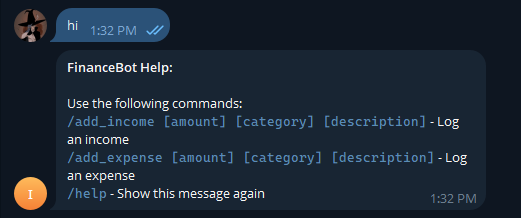

# Income-Expense Bot

A Telegram bot integrated with a Django-FastAPI backend for managing personal income and expenses. The application allows users to track their financial transactions, categorize them, and manage multiple currencies.

## Project Structure

```
├── api/                    # FastAPI application
│   ├── routers/           # API route handlers
│   ├── services/          # Business logic services
│   ├── schemas.py         # Pydantic models for request/response
│   ├── main.py           # FastAPI application entry point
│   └── dependencies.py    # Dependency injection setup
├── core/                  # Django core application
│   ├── models.py         # Database models
│   ├── admin.py          # Django admin configuration
│   └── management/       # Custom management commands
├── django_app/           # Django project configuration
│   ├── settings.py       # Django settings
│   └── urls.py          # URL routing
├── utils/                # Utility functions and helpers
├── .env                  # Environment variables
├── requirements.txt      # Python dependencies
└── startup.sh           # Startup script
```

## Features

- **User Management**
  - Telegram integration with user authentication
  - Custom user model with Telegram-specific fields
  - User-specific categories and transactions

- **Financial Tracking**
  - Income and expense tracking
  - Multi-currency support
  - Category-based organization
  - Transaction history with timestamps

- **API Endpoints**
  - RESTful API built with FastAPI
  - CORS support for cross-origin requests
  - JWT authentication
  - Telegram webhook integration

## Screenshots

### Bot Help Menu

*The bot's help menu showing available commands and usage instructions*

### Adding Income

*Example of adding an income record through the bot*

---

## Project Rationale & Technical Insights

### Why I Built This

This project began as a simple Telegram bot to help users log their income and expenses via natural language. As it evolved, I saw an opportunity to demonstrate how a traditional Django backend can be enhanced by integrating FastAPI to handle high-performance, real-time API interactions — such as Telegram webhook processing and JSON-based endpoints.

### Architecture Trade-offs: Django + FastAPI

I chose to integrate **FastAPI alongside Django** instead of building everything inside Django REST Framework to experiment with:
- **Faster request handling** for real-time bot communication
- **Better developer ergonomics** with Pydantic models for validation
- **Separation of concerns**, keeping Django for admin/db and FastAPI for APIs

However, this architecture introduced some trade-offs:
- **Dual server management** during development (Django + Uvicorn)
- **Increased complexity** for deployment and shared authentication
- **Maintaining consistency** between Django ORM and FastAPI schema expectations

Despite that, it provided a clean separation between the **business logic (Django)** and the **API layer (FastAPI)**.

### Pain Points

- **Telegram Parsing Complexity**: Interpreting user messages with flexible formats (+200 food, -50 rent, etc.) required careful text parsing and error handling.
- **Synchronous vs Asynchronous Code**: Mixing Django's sync ORM with FastAPI's async endpoints led to performance considerations and forced deliberate design choices.
- **Authentication Sync**: JWT-based auth for FastAPI needed to stay in sync with Django's session/user system.

### Future Features

I'm actively working on extending the bot and backend with:
- **More API Endpoints**: To allow a dedicated frontend client (web or mobile) to access user analytics, categories, and charts
- **AI Integration**: Using NLP to automatically categorize transactions or suggest savings tips
- **Budgeting & Reminders**: Let users set monthly budgets per category and receive alerts via Telegram
- **CSV Export**: Allow users to export their transaction history
- **Voice Command Support**: Experimental support for voice-to-text logging of transactions

This bot not only helps track finances — it demonstrates how I approach designing hybrid backends, weigh trade-offs, and evolve a simple idea into a scalable project.

---

## Data Models

### User
- Custom user model extending Django's AbstractUser
- Telegram-specific fields (ID, username, first/last name, etc.)
- Authentication and permissions management

### Currency
- Support for multiple currencies
- Default currency selection
- Currency code and symbol management

### Category
- User-specific categories
- Active/inactive status
- Description and metadata

### Income/Expense
- Amount and currency tracking
- Category association
- Date and description fields
- Timestamp tracking

## Setup and Installation

1. **Environment Setup**
   ```bash
   python -m venv env
   source env/bin/activate  # On Windows: env\Scripts\activate
   pip install -r requirements.txt
   ```

2. **Environment Variables**
   Create a `.env` file with the following variables:
   ```
   DJANGO_SECRET_KEY=your_secret_key
   DATABASE_URL=your_database_url
   TELEGRAM_BOT_TOKEN=your_bot_token
   ```

3. **Database Setup**
   ```bash
   python manage.py migrate
   ```

4. **Running the Application**
   ```bash
   # Start Django development server
   python manage.py runserver

   # Start FastAPI server
   uvicorn api.main:app --reload
   ```

## API Documentation

The API documentation is available at `/docs` when running the FastAPI server. It includes:

- Authentication endpoints
- User management
- Financial transaction endpoints
- Category management
- Currency operations

## Dependencies

- Django 5.2
- FastAPI 0.115.12
- Python-Telegram-Bot 22.0
- Django REST Framework
- Pydantic
- PostgreSQL (via psycopg2-binary)

## Contributing

1. Fork the repository
2. Create a feature branch
3. Commit your changes
4. Push to the branch
5. Create a Pull Request

## License

This project is licensed under the MIT License - see the LICENSE file for details. 